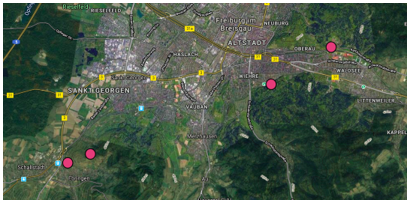
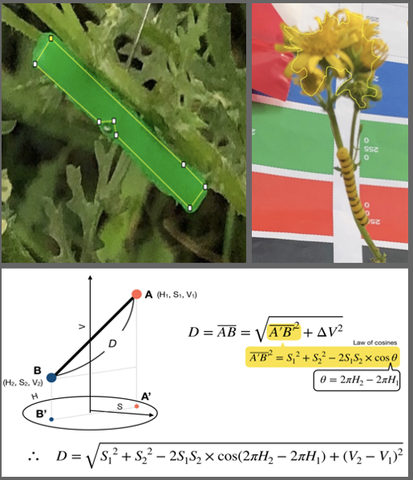
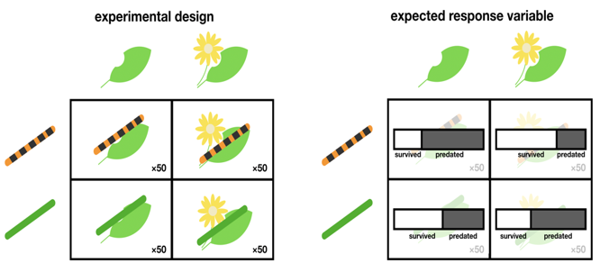

<h1 style="text-align:center; font-size:24px;">Predation Rates between Cryptic and Aposematic Strategies</h1>
                            
<h2 style="text-align:rightr; font-size:10px;">using artificial caterpillars</h2>

This note discusses the importance of caterpillars in the food chain and their vulnerability to predation. Caterpillars adopt different defense strategies such as cryptic, mimicry, and aposematism to protect themselves from predators. The cinnabar moth caterpillar is an example of a caterpillar that uses aposematism to signal toxicity and camouflage to avoid predation. The effectiveness of these defense strategies can be measured by studying the predation rates of predators using artificial caterpillar models. 

In this study, we use AC in four different areas of Freiburg(Germany) to test the following hypothesis: (1) The predation rates of the cryptic and aposematic caterpillars are the same (null hypothesis) or significantly different (alternative hypothesis) and (2) The color types of plant where these dummy caterpillars are installed have no effect (null hypothesis) or have a significant effect on the predation (alternative hypothesis)

## Method adapted
--------

The study conducted was aimed at investigating the role of caterpillar coloration and background in determining predation risk. The study was conducted on four randomly selected locations in Freiburg im Breisgau, Germany. The caterpillars were made of non-hardening plasticine and were of two types: pure green and yellow with black stripes. The AC was placed on two types of plants: Rockrose Polygala (RP) and any green plant (GP) without flowers. The plants with the AC were separated by at least 4m. After 72 hours, the AC were collected and examined for predation marks. The study found that the yellow and black striped caterpillars had higher predation rates, and the predation rate was significantly influenced by the background. 

  

### Statistical Analysis
--------

To obtain the color values, the RGB values of the caterpillar and plant background were extracted using ImageJ® software, and then transferred to HSV values using the matplotlib.colors.rgb_to_hsv function in Python. This allowed for testing of hypotheses related to the effect of color and color contrast on predation risk using statistical methods such as General Linear Mixed Models (GLMM) and Chi-square. The inclusion of the site variable as a random effect in the GLMM accounted for variation between sites. By testing the effects of COLOR_caterpillar, plant_color, and CONTRAST as fixed effects, the study provided valuable insights into the factors affecting predation risk in caterpillars.

  

#### Experimental Design!
--------

Hypothesis 1:  P(predated | aposematic) = P(predated | cryptic)
Hypothesis 2:  P(predation) ⊥ plant 

  

### Main findings
--------

- Rresults suggest that the color of the caterpillar has a significant effect on predation risk, with yellow caterpillars being less likely to be preyed upon than green caterpillars. 
- However, there is no evidence of an effect of the background color on predation risk. The random effect for the site indicates that there is some variation in predation risk that is specific to each site. 
- Moreover, we can hardly assign the yellow or green dummy caterpillars to be either cryptic or aposematic because of what we see from the color analysis.

### Requirements
--------

To run the code and reproduce the analysis, the following software and packages are required:

- [Python 3.x](https://www.python.org/)
- [Pandas](http://pandas.pydata.org/) > 1.4.2
- [NumPy](http://www.numpy.org/)
- [Matplotlib](http://matplotlib.org/)

## Authors
This project was created by Senayit Berhane. For questions or feedback, please contact senayita.hac@gmail.com
